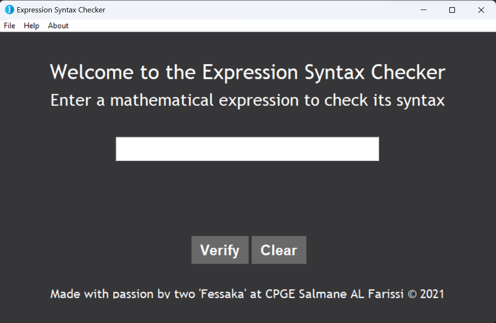

<h1 align="center">Expression Syntax Checker 🔍</h1>

This project is an expression syntax checker that helps users verify the syntax of their mathematical expressions. It was developed using the Tkinter library in Python and has a simple, user-friendly interface.

The program allows users to enter a mathematical expression and checks for any syntax errors, such as unbalanced brackets or invalid characters. If the expression is correctly formatted, a message is displayed indicating that the syntax is correct. If there are any errors, the program highlights the location of the error and suggests a possible solution.

It was developed by two passionate students at CPGE Salmane AL Farissi as a year-end project, showcasing their skills in both Python and data structures.

  
  
  

  

## Features 🌟
- Enter any mathematical expression and check if it has a valid syntax
- User-friendly interface with a sleek design 💻

## Updates 🆕

- Added menu bar with options for creating a new window and quitting the program
- Improved design and layout of the user interface
- Improved error handling and messaging for invalid syntax

## Requirements 📋
- Python 3.7 or higher
- Tkinter

## Usage 📝
1. Clone or download the repository.
2. Navigate to the project directory.
3. Run the program with python GUI.py
4. Enter the mathematical expression in the input field.
5. Click the "Verify" button to check the syntax.
6. Check the result in the result field.

## Contribute 🤝
We welcome any contributions to this project. If you have any suggestions or found any bugs, please open an issue or create a pull request.

## License 📜
This project is licensed under the MIT License. See the [LICENSE](https://github.com/ilyas0421/PROJET_INFO/edit/master/LICENSE.md) file for details.

## Credits
- Developed with passion by [@ilyas0421](https://github.com/ilyas0421) and [@othmane-lk](https://github.com/othmane-lk)
- Icon made by [Flaticon](<a href="https://www.flaticon.com/free-icons/curly-bracket" title="curly bracket icons">Curly bracket icons created by Hight Quality Icons - Flaticon</a>) 🖼

## Show your support

Give a ⭐️ if this project helped you!